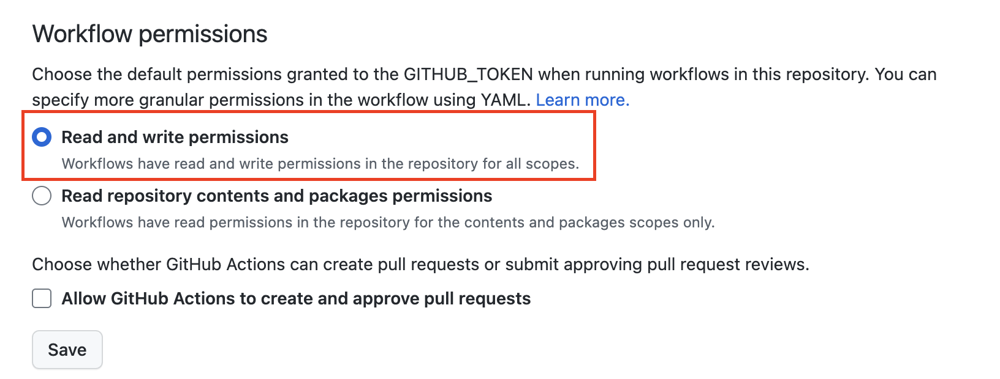
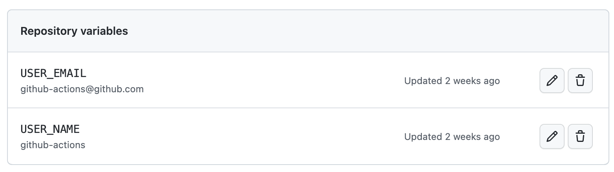
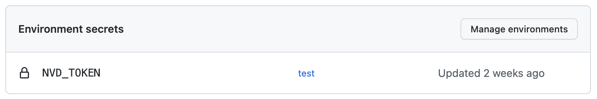

The first step is to grant the workflow some permissions to the repository.

Go to Repo -> Settings -> Actions -> General-> Workflow permissions and choose `Read and Write permissions.`

Next, you need to define the variables, which will be used to configure git parameters `user.name` and `user.email`.

Go to Repo -> Settings -> Secrets and variables and add new repository variables USER_EMAIL and USER_NAME .

And the last step, it is not necessary, but it is desirable, because it will increase the speed of vulnerability updates.

1. [Get](https://nvd.nist.gov/developers/request-an-api-key) the NVD api key.

2. Go to Repo -> Settings -> Secrets and variables and add new repository secret `NVD_TOKEN`.

